# CardioGuard: Heart Disease Prediction System

CardioGuard is a role-based web application for heart disease risk screening and patient record management. It combines a Flask backend, a machine learning prediction model, SQLite storage, and Tailwind-powered frontend pages to support three user groups: patients, doctors, and administrators.

The project allows patients to register, submit heart-health parameters for prediction, review their prediction history, download PDF reports, and optionally receive reports by email. Doctors can review patient records, while administrators can manage doctors, patients, feedback, and analytics from a dedicated dashboard.

## Project Description

This project is designed as a healthcare support platform for preliminary heart disease risk assessment. A trained machine learning model processes patient input data such as age, cholesterol, blood pressure, ECG values, and exercise-related indicators to classify the result as either `High Risk` or `Low Risk`.

CardioGuard is intended for screening support and workflow management. It is not a replacement for professional medical diagnosis.

## Features

- Heart disease risk prediction using a saved machine learning model and scaler
- Patient registration and login
- Separate role-based login flows for patients, doctors, and admins
- Patient dashboard with prediction history and profile management
- Downloadable PDF prediction reports
- Optional prediction report delivery through SMTP email
- Doctor suggestions for high-risk cases
- Doctor dashboard for viewing patient records
- Admin dashboard with platform statistics and analytics
- Admin tools for adding, updating, and deleting doctors
- Admin tools for viewing and deleting patients
- Feedback collection and review
- Password reset flow for patient and doctor accounts
- SQLite-based persistence for accounts, predictions, and feedback

## Tech Stack

- Backend: Python, Flask, Flask-CORS
- Frontend: HTML, Tailwind CSS, JavaScript
- Machine Learning: scikit-learn model loaded with Joblib
- Database: SQLite
- Authentication/Security: bcrypt
- Reporting: FPDF
- Optional Email Delivery: SMTP

## Project Structure

```text
heart-disease-project/
|-- backend/
|   |-- app.py
|   |-- models/
|   |   |-- best_model.pkl
|   |   `-- scaler.pkl
|   |-- data/
|   |   `-- database.db
|   |-- static/
|   |   |-- js/
|   |   `-- vendor/
|   `-- templates/
|-- database/
`-- Heart_Disease_Prediction_Review5 (1).ipynb
```

## Installation

### 1. Clone the repository

```bash
git clone <your-repository-url>
cd heart-disease-project
```

### 2. Create and activate a virtual environment

Windows PowerShell:

```powershell
python -m venv .venv
.venv\Scripts\Activate.ps1
```

### 3. Install Python dependencies

```bash
pip install -r requirements.txt
```

### 4. Optional: install frontend dependency

The repository already includes the required `bcryptjs` browser bundle in `backend/static/vendor/`, so this step is usually optional.

If you want to align with the included `package.json`:

```bash
cd backend
npm install
cd ..
```

### 5. Optional: configure email delivery

Set these environment variables only if you want prediction reports emailed to patients:

```powershell
$env:SMTP_HOST="smtp.example.com"
$env:SMTP_PORT="587"
$env:SMTP_USERNAME="your_username"
$env:SMTP_PASSWORD="your_password"
$env:SMTP_FROM_EMAIL="noreply@example.com"
$env:SMTP_USE_TLS="true"
```

### 6. Configure deployment environment variables

For a fresh deployed environment, set these variables so the first admin account is created automatically:

```powershell
$env:FLASK_ENV="production"
$env:ADMIN_USERNAME="admin"
$env:ADMIN_PASSWORD="change-this-admin-password"
```

## Usage

### 1. Start the application

From the `backend` directory:

```bash
python app.py
```

The Flask app runs locally at:

```text
http://127.0.0.1:5000
```

### 2. Open the app

Visit the home page in your browser:

```text
http://127.0.0.1:5000
```

### 3. Access the system by role

- Patient: register from the registration page, then log in to access prediction, history, profile, and feedback pages
- Doctor: log in with an assigned doctor account to access doctor dashboard and patient records
- Admin: log in with the admin account created from the `ADMIN_USERNAME` and `ADMIN_PASSWORD` environment variables

Example admin credentials:

```text
Username: admin
Password: change-this-admin-password
```

### 4. Patient workflow

1. Register a patient account
2. Log in as `patient`
3. Open the prediction page
4. Enter the required health values
5. Submit the form to receive a `High Risk` or `Low Risk` result
6. Review doctor recommendations for high-risk outcomes
7. Download the generated PDF report or email the latest report if SMTP is configured

## Screenshots

### Public Pages

**Home Page**

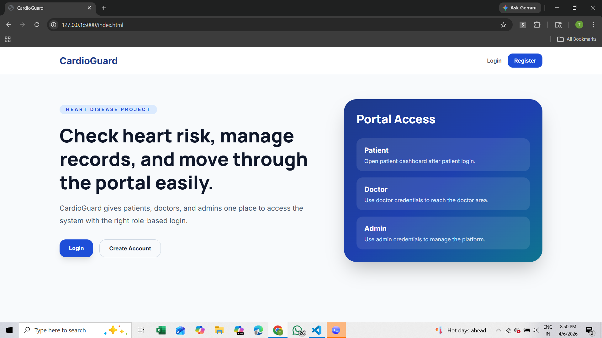

**Login Page**

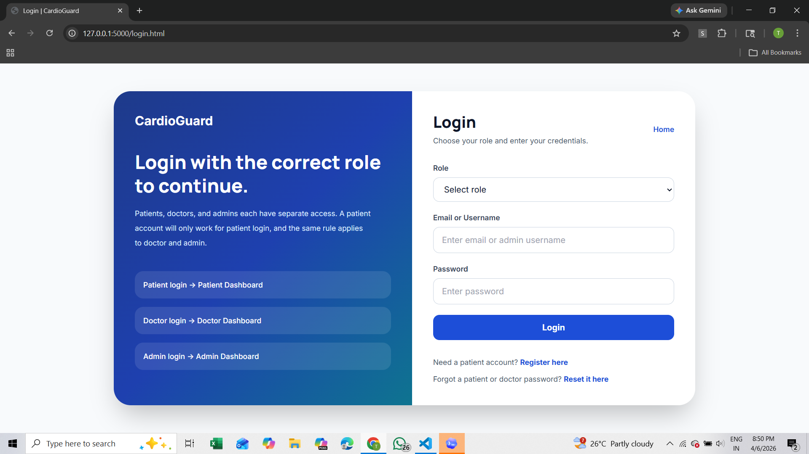

**Patient Registration**

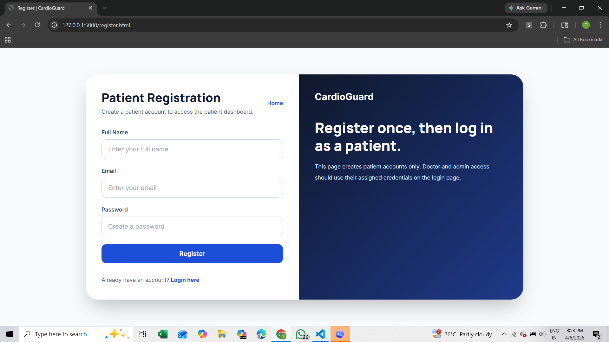

### Patient Module

**Patient Dashboard**

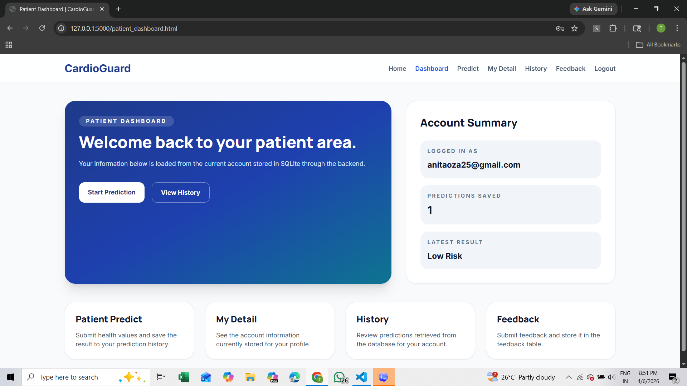

**Heart Risk Prediction**

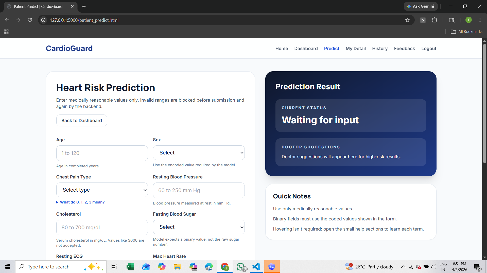

**Patient Profile**

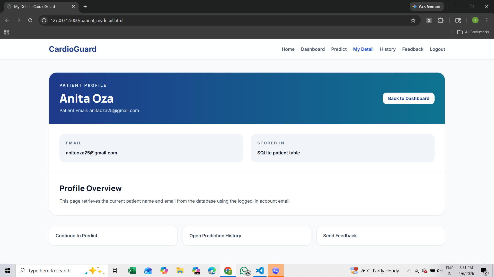

**Prediction History**

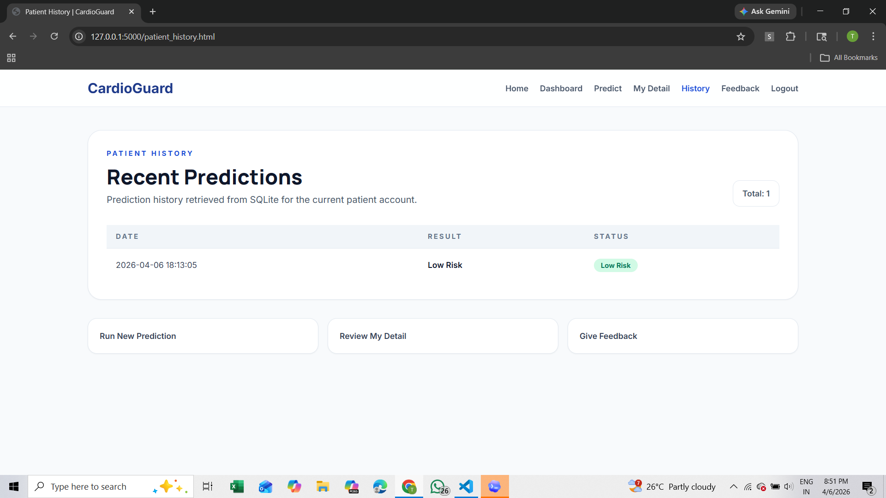

**Feedback Page**

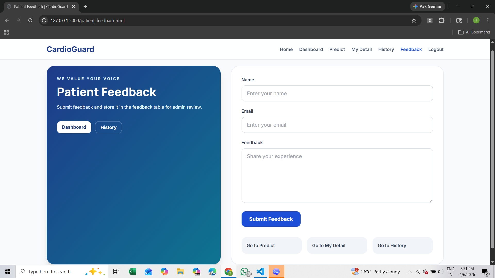

### Doctor Module

**Doctor Dashboard**

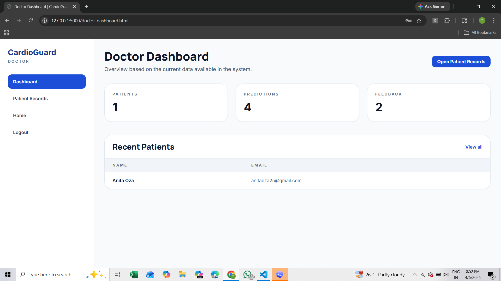

**Patient Records**

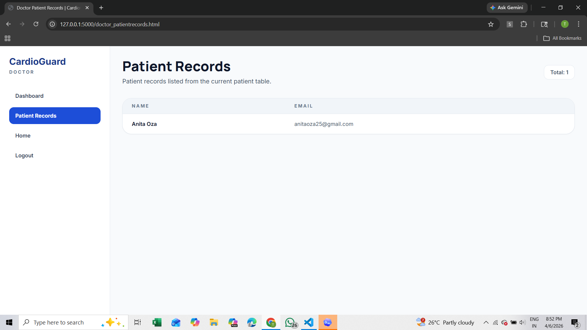

### Admin Module

**Admin Dashboard**

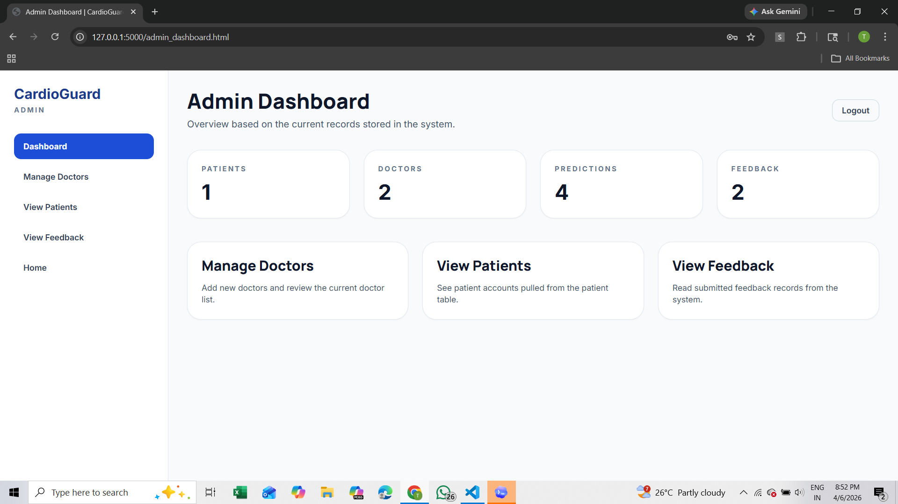

**Manage Doctors**

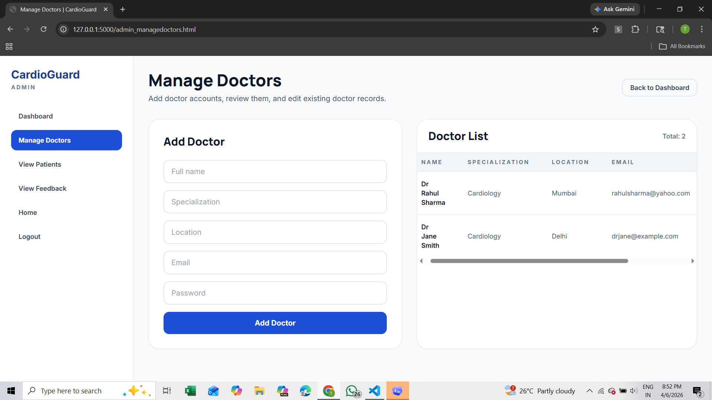

**View Patients**

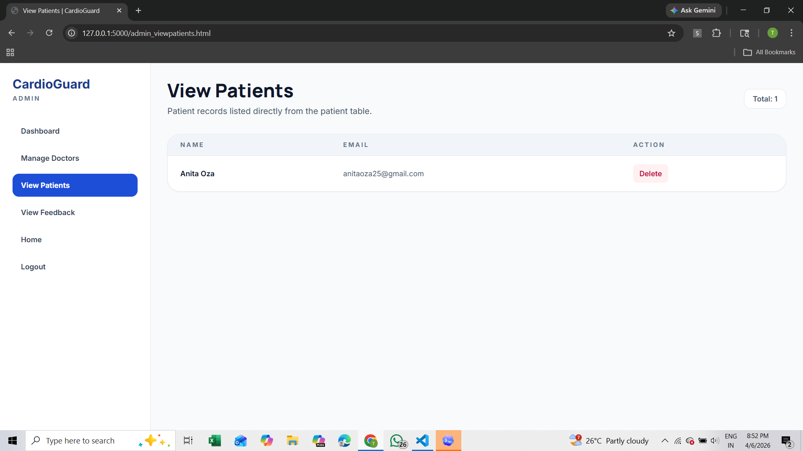

**View Feedback**

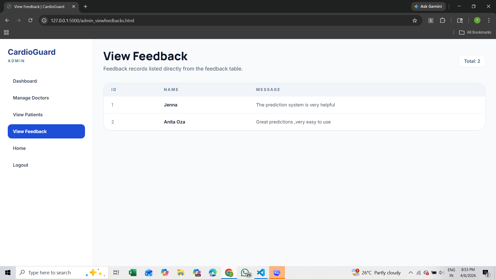

## Notes

- The machine learning assets are loaded from `backend/models/`
- The SQLite database is created and managed automatically in `backend/data/database.db`
- Passwords are stored with bcrypt hashing
- Prediction reports are intended for screening support only, not medical diagnosis
- Frontend API calls now use same-origin paths, which makes the app deployment-friendly behind a real domain or reverse proxy

## Deployment Notes

- `requirements.txt` is included for Python dependency installation
- `wsgi.py` is included for WSGI servers
- `Procfile` is included for platforms such as Render or Railway
- Set `FLASK_ENV=production` in hosted environments
- Set `ADMIN_USERNAME` and `ADMIN_PASSWORD` before first startup if the deployed database is new
- SQLite is suitable for demos and light usage; PostgreSQL is recommended for more serious production use

## Future Improvements

- Add a `requirements.txt` file for repeatable Python setup
- Add automated tests for prediction and authentication flows
- Improve deployment configuration for production hosting
- Store secrets securely with environment-based configuration management
